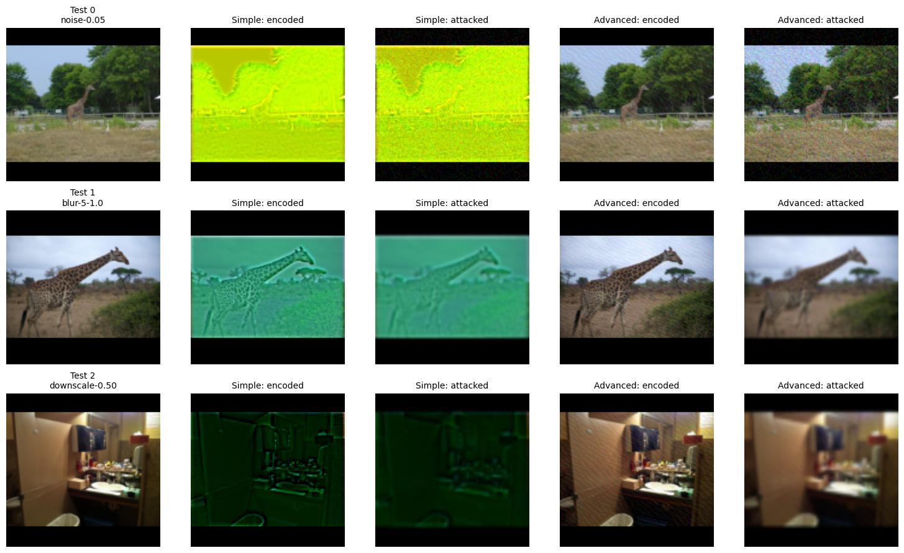

# DeepImageWatermarking

Image watermarking with PyTorch: embed a 16-bit message into an RGB image and
recover it after image distortions. The project compares a simple CNN baseline
with a HiDDeN-inspired encoder-decoder, using BER and exact message accuracy for
decoding, and PSNR and SSIM for image quality.

## Project Layout

| Location                                                                                               | Contents                                                          |
| ------------------------------------------------------------------------------------------------------ | ----------------------------------------------------------------- |
| [notebooks/01_data.ipynb](notebooks/01_data.ipynb)                                                     | Dataset download, preparation and basic analysis.                 |
| [notebooks/02_simple_architecture_training.ipynb](notebooks/02_simple_architecture_training.ipynb)     | Simple-model experiments and results.                             |
| [notebooks/03_advanced_architecture_training.ipynb](notebooks/03_advanced_architecture_training.ipynb) | HiDDeN-inspired model, clean training and robustness fine-tuning. |
| [notebooks/04_evaluation.ipynb](notebooks/04_evaluation.ipynb)                                         | Final evaluation and visual examples.                             |
| [src/](src/)                                                                                           | Models, data loading, training, attacks and evaluation metrics.   |
| [tests/](tests/)                                                                                       | Unit tests for the pipeline and its components.                   |
| [data/](data/)                                                                                         | Saved splits; downloaded images are stored locally in `raw/`.     |

## Dataset

We use the 5,000 images from [COCO 2017 validation](https://cocodataset.org/#download)
(`val2017`) with a fixed split of 4,000 training, 500 validation and 500 test images.
Images are resized with their aspect ratio preserved, then padded to 128x128.
Content masks exclude padding from image-quality measurements. Run the data
notebook first; the raw images are not included in Git.

## Setup

Install Conda and run from the repository root (on Windows, use Anaconda Prompt):

```bash
conda env create -f environment.yml
conda activate deep-image-watermarking
jupyter lab
```

Select the `deep-image-watermarking` kernel. Package versions are listed in
[environment.yml](environment.yml). CUDA training requires a compatible NVIDIA
GPU and driver; the models also support CPU execution.

The final trained HiDDeN-inspired checkpoint is included under
`results/checkpoints/different-architecture-robust-fused-decoder/`.
Other experiment checkpoints and training CSV logs are kept locally.

Run the tests from the repository root:

```bash
python -m unittest discover -s tests -v
```

## Example



## References

- [NeuralHash](https://github.com/nikcheerla/neuralhash): robust image-watermarking reference project.
- [HiDDeN: Hiding Data With Deep Networks](https://arxiv.org/abs/1807.09937): encoder-decoder watermarking with simulated distortions (Zhu et al., ECCV 2018).

## Authors

- David Toholj
- Luka Matić
